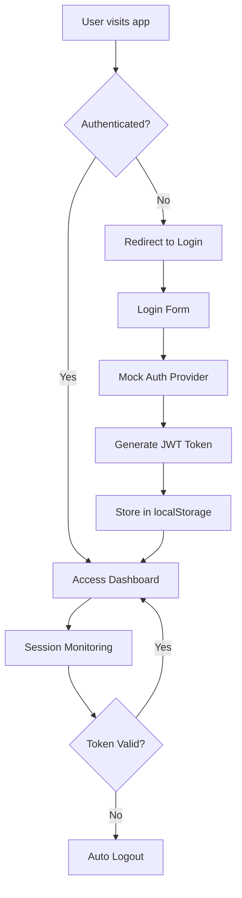

# Authentication System Integration Guide

## Overview

This project includes a comprehensive authentication system with glassmorphism design integration, featuring mock authentication for development/demo purposes, complete auth flow management, and role-based access control.

## 🔐 System Features

### Core Authentication
- **Mock Authentication Provider**: Realistic JWT simulation without backend APIs
- **Session Management**: Token expiration, automatic logout, and persistence
- **User State Management**: Context-based user data across the application
- **Protected Routes**: Route protection with authentication and role requirements
- **Error Handling**: Comprehensive error boundaries and recovery mechanisms

### Design Integration
- **Glassmorphism UI**: Modern glass-like design for auth forms
- **Responsive Layout**: Mobile-first design with adaptive layouts
- **Loading States**: Smooth loading animations and skeleton screens
- **Interactive Elements**: Hover effects, transitions, and micro-interactions

### Development Features
- **Demo Accounts**: Pre-configured test accounts for immediate testing
- **Session Monitoring**: Real-time session status and expiration tracking
- **Debug Tools**: Session status overlay and authentication debugging
- **Error Recovery**: Graceful error handling with recovery options

## 🚀 Quick Start

### Demo Accounts

The system comes with pre-configured demo accounts for testing:

| Role | Email | Password | Features |
|------|-------|----------|----------|
| Administrator | `admin@community.com` | `admin123` | Full access, admin panel |
| Community Leader | `sarah@community.com` | `sarah123` | Enhanced permissions |
| Community Member | `demo@test.com` | `demo123` | Standard access |

### Basic Usage

1. **Start the application**:
   ```bash
   npm run dev
   ```

2. **Access login page**: Navigate to the application root
3. **Demo credentials**: Click "Show Test Accounts" to see available demo users
4. **Login**: Use any demo account or create a new one via registration
5. **Dashboard**: Access protected dashboard with user-specific content

## 📁 System Architecture

### Components Structure

```
src/components/auth/
├── AuthProvider.tsx           # Real auth provider (for production)
├── MockAuthProvider.tsx       # Mock auth provider (for demo)
├── LoginForm.tsx             # Login/Registration form
├── ProtectedRoute.tsx        # Route protection components
├── AuthErrorBoundary.tsx     # Error handling
├── SessionStatus.tsx         # Session monitoring
└── index.ts                  # Exports
```

### Authentication Flow



## 🛠 Technical Implementation

### Mock JWT Structure

The system generates realistic JWT tokens with the following structure:

```typescript
// Header
{
  "alg": "HS256",
  "typ": "JWT"
}

// Payload
{
  "sub": "user-id",
  "email": "user@example.com",
  "name": "User Name",
  "role": "Community Member",
  "iat": 1234567890,
  "exp": 1234654290  // 24 hours expiration
}

// Signature (mock)
"mock_signature_random_string"
```

### State Management

The authentication state is managed through React Context:

```typescript
interface AuthContextType {
  user: User | null;
  token: string | null;
  isLoading: boolean;
  isAuthenticated: boolean;
  login: (email: string, password: string) => Promise<void>;
  logout: () => void;
  register: (userData: any) => Promise<void>;
  refreshAuth: () => Promise<void>;
}
```

### User Object Structure

```typescript
interface User {
  id: string;
  email: string;
  name: string;
  role: string;
  avatar?: string;
  createdAt: string;
  lastLoginAt?: string;
}
```

## 🎨 Design System Integration

### Glassmorphism Components

The authentication system uses the glassmorphism design system:

- **GlassCard**: Container with frosted glass effect
- **GlassForm**: Form wrapper with validation
- **GlassInput**: Input fields with glass styling
- **GlassButton**: Buttons with glass morphism effects
- **GlassNavigation**: Navigation with backdrop blur

### Theme Integration

- **Light/Dark Mode**: Automatic theme adaptation
- **Responsive Design**: Mobile-first approach
- **Accessibility**: WCAG compliant form elements
- **Animations**: Smooth transitions and loading states

## 🔒 Security Features

### Token Management
- **Expiration Checking**: Automatic token validation
- **Secure Storage**: localStorage with error handling
- **Session Monitoring**: Periodic token validity checks
- **Auto Logout**: Expired token automatic cleanup

### Route Protection
- **Authentication Gates**: Protected route wrapper
- **Role-Based Access**: Role requirement validation
- **Fallback Handling**: Graceful access denied pages
- **Redirect Logic**: Proper navigation flow

### Error Handling
- **Error Boundaries**: Catch and handle auth errors
- **Recovery Mechanisms**: User-friendly error recovery
- **Debug Information**: Development error details
- **Graceful Degradation**: Fallback UI states

## 📊 Usage Examples

### Basic Authentication

```tsx
import { MockAuthProvider, useMockAuth } from './components/auth';

function MyApp() {
  return (
    <MockAuthProvider>
      <AppContent />
    </MockAuthProvider>
  );
}

function AppContent() {
  const { isAuthenticated, user, login, logout } = useMockAuth();
  
  if (isAuthenticated) {
    return <Dashboard user={user} onLogout={logout} />;
  }
  
  return <LoginForm onLogin={login} />;
}
```

### Protected Routes

```tsx
import { ProtectedRoute } from './components/auth';

function App() {
  return (
    <Routes>
      <Route 
        path="/dashboard" 
        element={
          <ProtectedRoute>
            <Dashboard />
          </ProtectedRoute>
        } 
      />
      
      <Route 
        path="/admin" 
        element={
          <ProtectedRoute requireRole="Administrator">
            <AdminPanel />
          </ProtectedRoute>
        } 
      />
    </Routes>
  );
}
```

### Role-Based Content

```tsx
function Dashboard() {
  const { user } = useMockAuth();
  
  return (
    <div>
      <h1>Welcome, {user?.name}!</h1>
      
      {user?.role === 'Administrator' && (
        <AdminControls />
      )}
      
      {user?.role === 'Community Leader' && (
        <LeaderTools />
      )}
    </div>
  );
}
```

## 🧪 Testing & Development

### Demo Mode Features

1. **Test Accounts**: Pre-configured demo users
2. **Session Status**: Real-time session monitoring overlay
3. **Debug Tools**: Authentication state inspection
4. **Error Simulation**: Test error scenarios
5. **Component Showcase**: Design system demonstration

### Development Tools

- **Session Status Overlay**: Bottom-right session monitor
- **Component Toggle**: Show/hide design system showcase
- **Error Boundaries**: Comprehensive error handling
- **Console Logging**: Detailed authentication flow logs

## 🔄 Migration to Production

### Replacing Mock Authentication

To migrate from mock to real authentication:

1. **Replace MockAuthProvider** with AuthProvider
2. **Update API endpoints** in auth service calls
3. **Configure real JWT handling** in token management
4. **Update validation logic** for production requirements
5. **Add server-side session management**

### Production Considerations

- **HTTPS Requirements**: Secure token transmission
- **Token Refresh**: Implement refresh token flow
- **Rate Limiting**: Prevent brute force attacks
- **Session Security**: HttpOnly cookies for token storage
- **CSRF Protection**: Cross-site request forgery prevention

## 📋 Feature Checklist

### ✅ Implemented Features

- [x] Mock authentication provider with JWT simulation
- [x] Login form with glassmorphism design integration
- [x] Registration form with validation
- [x] Dashboard layout with user authentication state
- [x] Protected route components
- [x] Role-based access control
- [x] Session management and expiration
- [x] Error handling and loading states
- [x] Demo data for immediate testing
- [x] Session status monitoring
- [x] Error boundaries and recovery
- [x] Responsive design integration

### 🔄 Available Enhancements

- [ ] Password reset flow
- [ ] Email verification
- [ ] Two-factor authentication
- [ ] Social login integration
- [ ] Remember me functionality
- [ ] Account settings page
- [ ] User profile management
- [ ] Admin user management

## 📞 Support & Documentation

For questions or issues with the authentication system:

1. Check the component documentation in each file
2. Review error messages in browser console
3. Use the session status overlay for debugging
4. Test with different demo accounts for role testing
5. Examine the comprehensive error boundary feedback

The system is designed to be self-documenting with extensive TypeScript types, detailed comments, and comprehensive error messages.